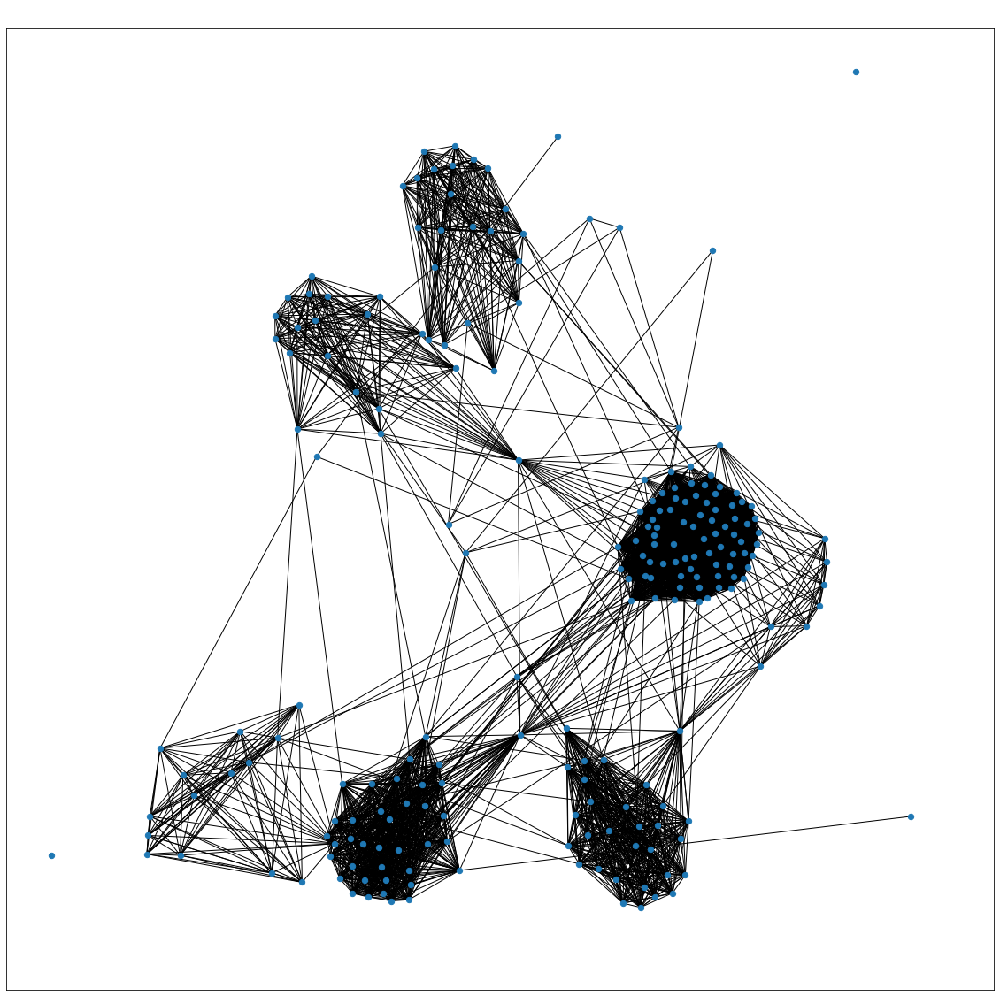
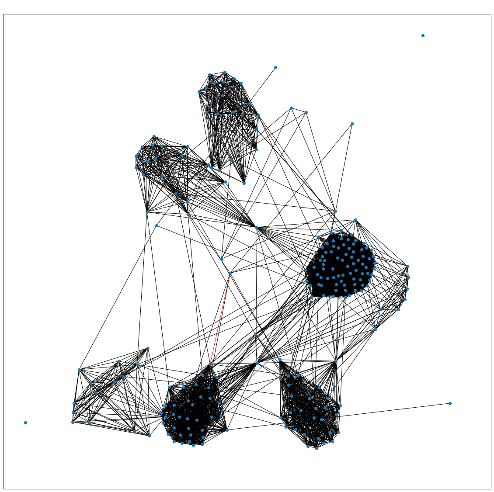

# Random_edge_predictor

## Principles

- Important Users (Degree Centrality)
- Largest Communities of Collaborators (Maximal Clique Concept)
- Build a Collaboration recommendation system (Open Traingle Concept)

Written in: 
- Python
- NetworkX
- Jupyter Notebook

## Example Graphs

Here is the base subgraph of a particular node and its neighbors. This does not have any predicted edges within it.

Now if we take the open traingle concept and apply it to this graph and predict edges based on scores of open traingles then we come up with this subgraph. The predicted edge is colored in red. 

